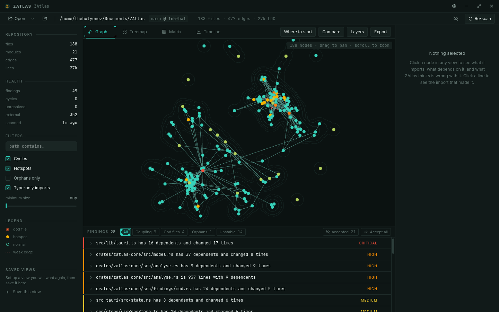
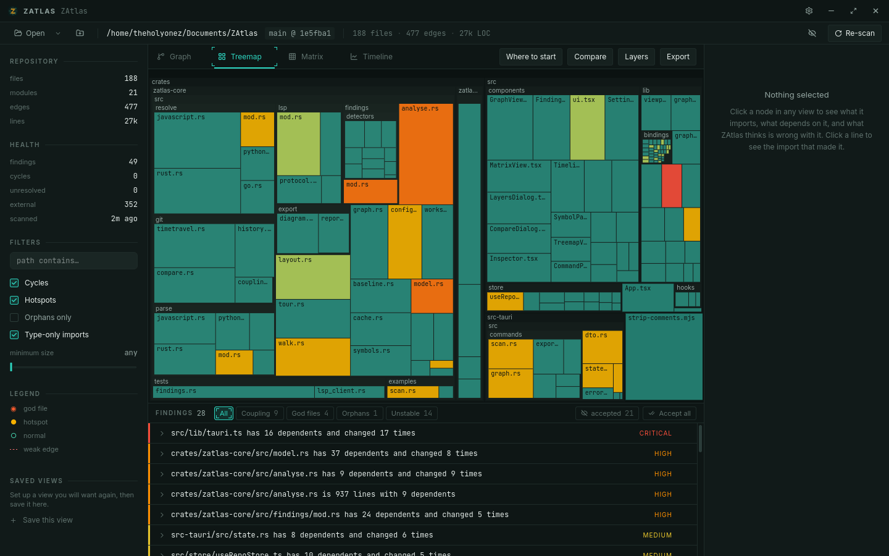
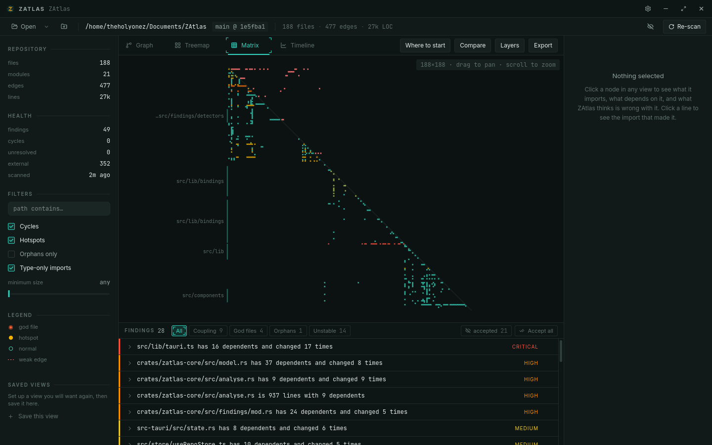
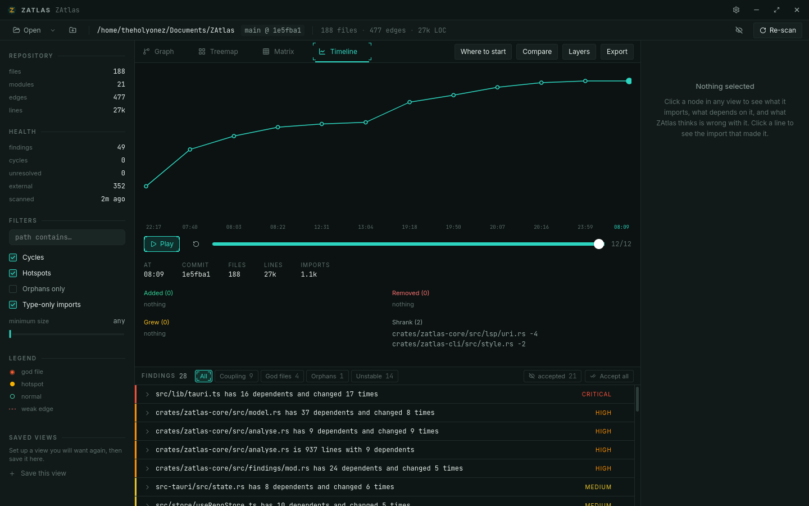
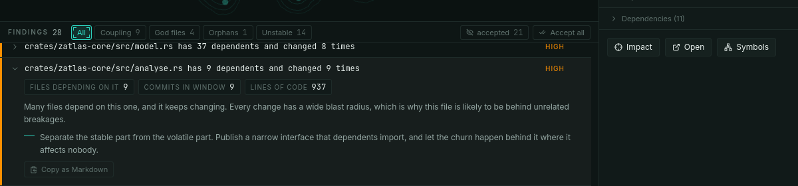
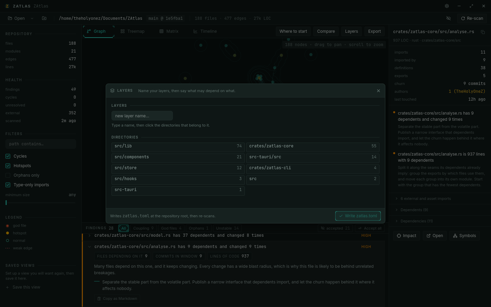

<div align="center">


# ZAtlas

### A map of a codebase you have never seen before.

Point it at a repository. In under a minute it draws the actual shape of that
codebase — the module dependency graph, every import cycle, where the mass is,
what changes together, what changes constantly, what is dead, and who wrote it.

Then it lets you ask questions of the map.

<br>

[](LICENSE)
[](#installing)
[](https://v2.tauri.app)
[](crates/zatlas-core)

**[Download](https://zsync.eu/zatlas/)** &nbsp;·&nbsp;
**[Source](https://github.com/TheHolyOneZ/ZAtlas)** &nbsp;·&nbsp;
**[More Z tools](https://zsync.eu/)** &nbsp;·&nbsp;
**[ZLogic](https://zlogic.eu)** &nbsp;·&nbsp;
**[Author](https://github.com/TheHolyOneZ)**

<sub><b>Free forever · open source · no telemetry · no account · fully offline</b></sub>

<br>



</div>

---

## Table of contents

<table>
<tr valign="top">
<td width="33%">

**Start here**
- [What it is](#what-it-is)
- [Why it exists](#why-it-exists)
- [Installing](#installing)
- [Your first scan](#your-first-scan)

</td>
<td width="33%">

**The app**
- [The four views](#the-four-views)
- [Findings](#findings)
- [The inspector](#the-inspector)
- [Layers](#layers)
- [Time travel](#time-travel)
- [Comparing branches](#comparing-branches)
- [Export](#export)
- [Keyboard](#keyboard)

</td>
<td width="33%">

**Going further**
- [Honest by construction](#honest-by-construction)
- [Language servers](#language-servers)
- [The baseline](#the-baseline)
- [The CLI](#the-cli)
- [Configuration](#configuration)
- [Architecture](#architecture)
- [Building from source](#building-from-source)
- [What it is not](#what-it-is-not)

</td>
</tr>
</table>

---

## What it is

ZAtlas is a desktop application that reads a repository and draws it.

Not a file tree — a file tree tells you where things are filed, which is a
decision someone made once and rarely revisited. ZAtlas draws what the code
*actually does*: which file imports which, which modules form a knot, which
files are large **and** widely depended upon **and** changed every week, which
files nothing imports at all, and which pairs of files always change together
despite having no connection in code.

It runs entirely on your machine. Nothing is uploaded, there is no account, and
it works with the network cable pulled out.

<table>
<tr valign="top">
<td width="50%">

**It reads**
- TypeScript · JavaScript · TSX · JSX
- Rust
- Python
- Go
- Your git history, from the object database

</td>
<td width="50%">

**It never**
- modifies your source or your history
- checks anything out
- moves a ref or touches your index
- phones home

</td>
</tr>
</table>

---

## Why it exists

Opening an unfamiliar repository costs you two hours of building a mental model
that the repository could have handed you in thirty seconds. You open the file
tree, guess at the entry point, follow imports by hand, and slowly assemble a
picture that the codebase already contains and simply does not show you.

Maintaining a *familiar* repository has the opposite problem. It hides its own
rot. Cycles form quietly. A file becomes four thousand lines one commit at a
time. A module everyone depends on gets rewritten six times a quarter and
nobody notices until the third outage traces back to it. None of that is visible
in a file tree, because none of it is about where files are filed.

Both problems are the same problem: **the shape of the codebase is real, and
invisible.**

### What else is out there

| | What it gets wrong |
|---|---|
| `madge`, `dependency-cruiser` | JS/TS only, static SVG output, no exploration, no history |
| IDE structure views | Symbol-at-a-time. No whole-repo shape, no cross-language |
| CodeScene, Sourcegraph | SaaS, per-seat, upload-your-code — overkill for one developer |
| `cloc`, `tokei` | Counts lines. Tells you nothing about structure |
| **Sourcetrail** | The closest ancestor, and **discontinued** — it left a real hole |
| **ZAtlas** | **Local, offline, fast, explorable, and honest about what it could not resolve** |

That last word is the one that matters, and it has its own section below.

---

## Installing

### Download

Prebuilt installers live on **[zsync.eu/zatlas](https://zsync.eu/zatlas/)** —
`.deb`, `.rpm` and `.AppImage` for Linux, an NSIS installer for Windows. Every
build ever published is browsable at
**[zsync.eu/zatlas/releases](https://zsync.eu/zatlas/releases/)**.

> **Where things live.** The site is the download page and a plain-language tour
> of what ZAtlas does. The **documentation is this README** — the site
> deliberately does not duplicate it. GitHub holds the source and the docs;
> builds are published on the site.

### Or build it

See [Building from source](#building-from-source).

### The CLI

The analysis engine is a separate crate with no UI in it, so it also ships as a
terminal binary — the same code path, not a reimplementation that will drift.

```sh
cargo install --path crates/zatlas-cli
```

---

## Your first scan

Open a folder. That is the whole setup — there is no project file to create, no
config to write, and nothing to configure before you get an answer.

While it scans you will see a progress line move through **walking → parsing →
indexing → resolving**. On a 5,000-file repository that takes about three and a
half seconds cold. The second scan of the same repository takes a fraction of
that, because parse results are cached by content hash rather than by path.

When it finishes, the left rail tells you the shape of what you just opened:

```
REPOSITORY          HEALTH
files       188     findings      49
modules      21     cycles         0
edges       477     unresolved     0
lines       27k     external     352
                    scanned  just now
```

**`unresolved`** is the number to look at first. It is how many imports ZAtlas
could not turn into an edge — and it is a feature, not an error. See
[Honest by construction](#honest-by-construction).

---

## The four views

Four ways of looking at the same graph. Selection is shared between them: click
a file in the graph, switch to the matrix, and it is still selected.

### Graph

<sub>Press <kbd>1</kbd></sub>


The dependency graph, laid out by a force simulation that runs **in Rust with a
fixed seed** — so the same repository always draws the same map. That matters
more than it sounds: a graph that rearranges itself between runs is a graph you
cannot build a memory of.

- **Nodes** are files, sized by `sqrt(LOC)` — never linear, or one file eats the
  screen — and coloured by how dangerous they are on a perceptually uniform
  teal → amber → red ramp, always paired with a glyph so it survives greyscale
  and colour-blindness.
- **Edges** are imports. Weak edges — an import that stopped at a barrel file
  rather than reaching the file that defines the symbol — are drawn red and
  dashed, because they are weaker evidence and the map should say so.
- **The ground** is a density contour field. Those are not decoration: they are
  isolines through the node density, so a tight module reads as a hill and empty
  space stays empty. It is a map, and it is drawn like one.
- **Click a node** for the inspector. **Click a line** to see the exact import
  statement that created it.

Drag to pan, scroll to zoom. The layout settles over 800 ms and then **freezes** —
a permanently jiggling graph is unusable.

### Treemap

<sub>Press <kbd>2</kbd></sub>



Where the mass actually is. Every file is a rectangle sized by lines of code and
nested inside its directory, so the answer to "what is this codebase mostly made
of" is one glance rather than a spreadsheet.

Colour carries severity, so a large **and** dangerous file is visible as a big
warm block rather than something you have to go looking for. The status line at
the bottom-left names whatever is under the cursor — it stays in one place
rather than following the pointer, so it never covers the thing you are pointing
at.

### Matrix

<sub>Press <kbd>3</kbd></sub>



The dependency structure matrix — the classic tool for spotting tangles, and
brutally effective at it.

Rows and columns are the same files in dependency order, so a mark at *(row,
column)* means "this row imports this column". With dependencies ordered before
dependents, everything below the diagonal is expected and **every mark above it
is a back-edge**. A cluster above the diagonal is a knot, visible instantly, in a
way no node-and-line drawing makes obvious.

The gutter marks each module with a bracket and its name, so you always know
roughly where you are — even zoomed out far enough that individual filenames
could not possibly be drawn. Drag to pan, scroll to zoom, hover any cell to read
the exact pair.

### Timeline

<sub>Press <kbd>4</kbd></sub>



The codebase over the last year, as a growth curve you can scrub and play.

Each point is a commit sampled evenly **by time** rather than by commit count —
a week with 300 commits and a month with two should not get the same number of
points on a chart about how the code changed. Step through it and the panel
below names exactly what was added, removed, grew and shrank between one
snapshot and the next.

This is affordable because history is read from the git object database, never
checked out, and because the cache is keyed by blob hash — so across twelve
monthly snapshots each unique version of a file is parsed exactly once, ever.

---

## Findings



A ranked, explainable list of what is wrong. Every row expands into the evidence
behind it, why it is a finding at all, and what to do about it — because a
finding you cannot interrogate is a finding you will not act on.

Scoring is **relative to the repository being scanned**, not against absolute
constants. Two thousand lines is a god file in one codebase and unremarkable in
another, so everything is a percentile within the project in front of you.

| Finding | What it means |
|---|---|
| **Import cycle** | A group of files that depend on each other in a loop, with one concrete chain through it. Reported as strongly-connected components — enumerating every simple cycle is exponential and will hang on a real tangle |
| **God file** | Large **and** widely depended upon **and** frequently changed. Any one of those alone is fine; all three together is where outages come from |
| **Orphan** | Nothing imports it, and it is not an entry point. Possibly dead code |
| **Unstable interface** | High fan-in and high churn. Many files depend on it and it will not sit still |
| **Layering violation** | A dependency that runs against the rules you declared. See [Layers](#layers) |
| **Bus factor** | One author has touched this file almost every time it changed |
| **Distant coupling** | Two files change together in most commits despite having no connection in code — a shared assumption living in two places |
| **Barrel hub** | A re-export file that everything routes through, hiding the real dependency structure behind it |
| **Case mismatch** | An import whose spelling differs from the filename only in case. Works on Windows and macOS, fails on Linux — which is usually where CI runs |
| **Resolver disagreement** | A language server disagrees with ZAtlas about where an import goes. See [Language servers](#language-servers) |
| **Path alias** | A `tsconfig` alias pointing at nothing, or declared and never used |

### Working through them

- **`]` and `[`** walk the list, focusing each finding in whichever view you are
  in. Triage becomes a two-key rhythm rather than read-aim-click-read.
- **Copy as Markdown** puts a finding — headline, evidence table, why, and the
  fix — on your clipboard, ready to paste into a pull request.
- **Accept** waives one row into the [baseline](#the-baseline), and the same
  button puts it back.

---

## The inspector

Click anything and the right-hand panel tells you about it.

**Select a file** and you get its size, language, module, imports and importers,
exported symbols, commit count, author concentration, when it was last touched,
and every finding that names it. Then the actions: **Impact** highlights
everything that transitively depends on it, **Open** hands the file to your
editor, **Symbols** draws the call graph inside its module.

**Select an edge** — click any line in the graph — and you get the thing that
makes the whole map checkable:

```
DEPENDENCY
src/lib/bindings/ZatlasConfig.ts
  → imports
src/lib/bindings/Layer.ts

WRITTEN HERE
:2   ./Layer                            type-only
```

The file, the line, the specifier as written, and how it was written. Every edge
on the map can be traced back to the statement that produced it. Two imports of
the same file are one dependency but two places to look, and both are listed.

---

## Layers



Declare that `ui` may depend on `domain`, and `domain` on `data`, and any
dependency running the other way becomes a finding.

Layering rules are the most valuable thing ZAtlas can check and the feature
almost nobody turns on, because the price of admission is normally hand-writing
config for a schema you have to go and read first. So this asks the two
questions that actually matter — which directories are which layer, and what may
depend on what — and writes the file for you.

The rule grid is deliberately the same shape as the dependency matrix: if you
have read the DSM you already know how to read "row depends on column". The
diagonal is drawn as given rather than offered, because a layer depending on
itself is what a layer *is*.

It writes [`zatlas.toml`](#configuration) at the repository root. Commit it and
the rules travel with the project.

---

## Time travel

Pick a point on the [timeline](#timeline) and the graph is rebuilt as it was at
that commit — files that did not exist yet are gone, files since deleted are
back, and every size is what it was then.

Nothing is checked out to do this. Trees and blobs are read straight from the
object database, and because the parse cache is keyed by content hash rather
than by path, the eleven-twelfths of the codebase that did not change between
two snapshots is not parsed a second time.

---

## Comparing branches

> **What did this branch do to the shape of the codebase?**

```sh
zatlas compare main                       # HEAD against main
zatlas compare v1.0 v2.0 --fail-on-cycle  # exits 1 if a cycle appeared
```

Or the **Compare** button in the app. Either way you get files added and removed,
what grew and shrank, which findings are new — and the part worth having:

**which cycles the branch introduced, and which it resolved.**

<details>
<summary><b>How it works, and why it is done that way</b></summary>

<br>

Each ref is written into a temporary directory of ZAtlas's own and analysed
there in full.

That is deliberate and it costs something. The cheaper approach — diffing blobs
and comparing line counts — cannot answer "did this branch introduce a cycle",
because that needs resolution, and resolution reads `tsconfig.json`,
`Cargo.toml` and `go.mod` from disk. Resolving a historic tree against the
**current** manifests would answer the wrong question exactly when a branch
changed a path alias, which is precisely when you would be asking.

Your repository is never checked out, no ref moves, no index is touched, and the
temporary directory is removed when the comparison ends.

</details>

---

## Export

| Format | What for |
|---|---|
| **D2** | Diagram source you can commit and render in CI |
| **Mermaid** | Renders inline on GitHub |
| **Markdown report** | Findings table, hotspots and what to do about them |
| **SVG** | The view itself, as vector |
| **PNG** | The view itself, as a bitmap at 2× |

SVG is generated from the graph data rather than captured from the screen, so it
stays sharp at any size and its labels stay selectable. Both picture formats
save exactly what you framed — the same pan, zoom and filters.

---

## Keyboard

<table>
<tr valign="top">
<td width="50%">

| | |
|---|---|
| `Ctrl` `K` | Command palette |
| `/` | Filter |
| `F5` | Re-scan |
| `?` | Where to start reading |
| `Ctrl` `E` | Export |
| `Ctrl` `,` | Settings |

</td>
<td width="50%">

| | |
|---|---|
| `1` `2` `3` `4` | Graph · Treemap · Matrix · Timeline |
| `F` | Focus selected |
| `Esc` | Clear focus |
| `C` | Collapse / expand cluster |
| `I` | Impact analysis |
| `E` | Open in editor |
| `]` `[` | Next / previous finding |

</td>
</tr>
</table>

In the graph and the matrix: **drag to pan, scroll to zoom.**

---

## Honest by construction

> **A dependency graph that is quietly wrong is worse than no graph.**

This is the rule the whole project is built around, and it has consequences you
can see.

Import resolution across real codebases is full of edge cases: path aliases,
barrel files, re-export chains, conditional imports, `#[path]` attributes,
`__init__.py`, module trees that are not file trees. Every tool in this space
gets some of them wrong. ZAtlas is different in what it does about that.

**An import it cannot resolve is recorded with a reason and shown to you.** It
is never silently dropped to make the picture look complete. The
`unresolved (n)` counter is a feature, and it is tested like one.

And the reasons are not one bucket. Outcomes that are *not* failures are kept
apart from ones that are:

<table>
<tr valign="top">
<td width="50%">

**Not a failure — this is where it went**
- `External` — an npm package or a crate
- `Asset` — a stylesheet, an image, JSON
- `ExcludedFromScan` — real, but you scoped it out
- `NoResolverForLanguage` — parsed for size only

</td>
<td width="50%">

**A failure — it should have resolved**
- `NoSuchFile` — the specifier matched nothing
- `UnmatchedAlias` — an alias pointing nowhere
- `FileNotInModuleTree` — no `mod` reaches this file
- `ReExportChainTooDeep` — a barrel chain that loops

</td>
</tr>
</table>

Every one of those variants exists because a real repository produced it.

A language with a grammar but no resolver contributes lines of code and nothing
else, and **says so** — it never emits an empty edge set that reads as "this
file imports nothing".

> Measured across 61 repositories: 3,581 files, 8,327 edges, and 14 unresolved
> imports — every one of them a Rust file that no `mod` declaration reaches,
> which is to say a file that does not compile.

### It does not touch your code

History is read straight from the git object database. Nothing is checked out
and no tracked file is touched. The `gix` dependency is compiled **without** the
`worktree-mutation` and `credentials` features, so the ability to modify your
repository is not merely unused — it is not in the binary.

The one thing ZAtlas writes is its own cache at `<repo>/.zatlas/`, which ships a
`.gitignore` of `*` so it never appears in `git status`. Delete it any time; it
is rebuilt on the next scan. Caching by content hash is what takes a re-scan of a
212-file repository from **920 ms to 8 ms**.

Two files it writes only when you explicitly ask: `zatlas.toml` (from the layers
dialog) and `zatlas-baseline.json` (from Accept). Both are yours to commit.

---

## Language servers

The resolvers are heuristics, and heuristics can be quietly wrong — which is the
one failure this tool cannot afford. So ZAtlas can ask a language server for a
second opinion.

| Mode | What it does |
|---|---|
| **Off** | The default. Nothing is started |
| **Repair** | Ask only about imports the resolvers could not place. Costs nothing when there are none, which is the usual case |
| **Verify** | Ask about **every** import and report each disagreement as a finding. Slow, and deliberately so — this is the mode that audits the map rather than the repository |

**The heuristics stay in charge either way**, and that is a deliberate design
decision rather than a limitation. They are deterministic — the same repository
draws the same map twice — they finish a 5,000-file repository in half a second,
and they do not depend on which servers happen to be installed. None of those
three things is true of a language server, and an LSP-first graph would quietly
differ between two scans of unchanged code depending on how far indexing had got.

Recognised: `rust-analyzer`, `typescript-language-server`, `gopls`, `pyright`,
`basedpyright`, `pylsp`.

This is **off unless you turn it on**, because it is the only part of ZAtlas
that starts another program. Servers are looked for on your `PATH` and nowhere
else, and only started for a language the scan actually found.

> One caveat stated plainly: some servers — rust-analyzer especially — build an
> index under `target/` while they work. ZAtlas still never touches tracked
> source or history, but this mode is not as inert as the rest of the app.

---

## The baseline

A findings list that reports the same 200 rows every run is a list people stop
reading, and a check that has been red since the day it was added is a check
people delete. So agree once, in writing:

```sh
zatlas baseline accept                  # writes zatlas-baseline.json — commit it
zatlas baseline accept --below medium   # waive only the small stuff
zatlas baseline status                  # what is new, accepted, and since fixed
zatlas baseline drop "SortBy.ts"        # put entries back in the list
zatlas baseline prune                   # drop entries that no longer occur
```

From then on `zatlas findings` reports only what appeared since, and `--fail-on`
judges only that. The app has the same controls: an **Accept all** button, a
per-row accept, and an `accepted (n)` chip to see what is hidden.

A finding is recognised by its kind, its files, and its headline **with the
numbers stripped out**. That is deliberate: a god file growing from 840 lines to
1,204 stays accepted, and an import moving down a file does not come back as
new. If magnitude alone should re-raise something, a threshold is the right tool,
not a baseline.

The file is plain JSON at the repository root, reviewable in a pull request, and
every entry takes an optional `note` recording *why* it was waived.

---

## The CLI

The desktop app is for exploring. The CLI is for the two things a window cannot
do: answer a question without being opened, and **fail a build**.

```sh
zatlas scan                    # a summary of the repository you are in
zatlas findings --explain      # every finding, with its evidence and its fix
zatlas cycles --fail           # exits 1 if there is a cycle
zatlas unresolved              # what did not resolve, and why
zatlas impact session.ts       # what breaks if you change this
zatlas tour                    # what to read first, in order
zatlas compare main            # what this branch did to the shape
zatlas export --format d2 -o graph.d2
zatlas baseline accept
```

The one that matters:

```yaml
- run: zatlas findings --fail-on high --max-unresolved 0
```

**Exit codes** are `0` clean, `1` threshold breached, `2` the tool itself
failed — so a crash is never mistaken for a passing build. The threshold is
judged against every finding, never the page that `--limit` happened to print,
so a display flag cannot turn a failing build green.

`--json` works on every command. Colour turns itself off when stdout is not a
terminal, when `NO_COLOR` is set, and on Windows consoles that would print the
escape codes rather than render them.

---

## Configuration

Entirely optional. A repository with no config analyses correctly.

<details>
<summary><b><code>zatlas.toml</code> — full reference</b></summary>

<br>

```toml
# Globs limiting the scan. Empty means everything the walk finds.
include = ["src/**", "crates/**"]

# Removed from the scan, applied after `include`.
exclude = ["**/generated/**", "**/*.test.ts"]

# Files treated as roots. Without these, every `main` looks like an orphan.
entrypoints = ["src/main.tsx", "crates/api/src/main.rs"]

# Allowed dependency directions. Anything else between two declared
# layers is a violation.
rules = ["ui -> domain", "domain -> data"]

[[layers]]
name = "ui"
paths = ["src/ui/**"]

[[layers]]
name = "domain"
paths = ["src/domain/**"]

[[layers]]
name = "data"
paths = ["src/data/**"]

[lsp]
mode = "off"             # off | repair | verify
servers = []             # empty means any that apply
timeoutMs = 5000
startupMs = 30000
budgetMs = 120000
```

The layers dialog writes this file for you, and reads it back when you reopen it
so you are editing rather than starting over.

</details>

<details>
<summary><b>Files ZAtlas writes</b></summary>

<br>

| Path | When | Commit it? |
|---|---|---|
| `.zatlas/cache.sqlite` | Every scan | No — it gitignores itself |
| `zatlas.toml` | Only from the layers dialog | Yes |
| `zatlas-baseline.json` | Only from Accept | Yes |

Nothing else. Ever.

</details>

---

## Themes

Four, and all four are first-class rather than a dark mode with the colours
inverted.

| | |
|---|---|
| **Cartograph** | The default. Near-black teal, the colour of a survey map at night |
| **Topographic Light** | Cream and brown-grey ink. The one for screenshots and printed reports |
| **Slate** | Cool blue-grey |
| **Contrast** | Maximum legibility |

Severity always uses a perceptually uniform OKLCh ramp from teal through amber to
red, and is **always paired with size and a glyph** — `○` normal, `●` hotspot,
`◉` god file — so the information survives greyscale printing and every form of
colour-blindness.

---

## Architecture

```
ZAtlas/
├── crates/
│   ├── zatlas-core/     The engine. Walk, parse, resolve, graph, git history,
│   │                    findings, layout, cache, export. No Tauri, no UI, and
│   │                    where most of the tests live.
│   └── zatlas-cli/      The terminal binary, over that same engine.
├── src-tauri/           The desktop shell: IPC commands and window management.
└── src/                 React 19 frontend.
```

### The stack

<table>
<tr valign="top">
<td width="50%">

**Engine — Rust**
- `tree-sitter` 0.25 — parsing, five grammars
- `gix` 0.87 — git, no checkout, no credentials
- `petgraph` 0.8 — graph algorithms
- `rusqlite` 0.32 — the content-hash cache
- `ignore` + `rayon` — parallel `.gitignore`-aware walk
- `blake3` — content hashing
- `notify` 8 — watch mode
- `clap` 4.6 — the CLI

</td>
<td width="50%">

**Shell &amp; UI**
- Tauri v2
- React 19 · TypeScript 5.8 · Vite 7
- Tailwind v4
- `zustand` 5 — state
- `ts-rs` 12 — Rust → TypeScript types, generated and committed
- `d3-hierarchy` — treemap and DSM ordering
- Canvas 2D — every data surface

</td>
</tr>
</table>

### Three decisions worth knowing

**The graph never crosses the IPC bridge as JSON.** It lives in Rust state. The
frontend gets a one-time compact payload, positions as a packed `Float32Array`,
and windowed queries for everything else. A hundred thousand nodes serialised as
JSON objects is tens of megabytes per update, and that is the entire difference
between smooth and unusable.

**Layout is computed in Rust with a fixed seed.** The UI animates to those
positions; it does not run a simulation. The same repository therefore always
draws the same map — which matters for screenshots, and for not disorienting you
between scans.

**The cache is keyed by blob hash, not by path.** A file that moves is not
re-parsed, and history snapshots share parse results with your working tree.
This one decision is what makes time travel affordable at all.

### Tested

```
551 Rust tests   ·   118 TypeScript tests   ·   clippy clean at -D warnings
```

The resolution suite is the one that matters: a corpus of small synthetic
repositories with expected edge lists, including a barrel file re-exporting 40
modules (the assertion being that importing one symbol yields **one** edge, not
40), `#[path]` overrides, `x.rs` versus `x/mod.rs`, pnpm workspaces, and
negative cases that each assert a *specific* unresolved reason.

There is also a determinism test: scan the same repository twice and assert
byte-identical layout positions and identical finding order. A map that redraws
differently each run is not a map.

---

## Building from source

Needs [pnpm](https://pnpm.io), a Rust toolchain, and the
[Tauri v2 prerequisites](https://v2.tauri.app/start/prerequisites/).

```sh
git clone https://github.com/TheHolyOneZ/ZAtlas
cd ZAtlas
pnpm install

pnpm tauri dev      # run it
pnpm tauri build    # bundle it
```

```sh
cargo test --workspace   # engine + shell + CLI
pnpm test                # frontend
```

<details>
<summary><b>Windows notes</b></summary>

<br>

Linux and Windows are both first-class targets, and the places where they
genuinely differ are handled rather than hoped for.

- **Paths** are stored repo-relative and `/`-separated, and joined one component
  at a time. A canonicalised root on Windows is a verbatim path (`\\?\C:\...`),
  and verbatim paths skip normalisation — so `join("src/a.ts")` there produces a
  filename with a slash *in* it rather than a subdirectory.
- **Case** — imports resolve case-sensitively first and fall back to a
  case-insensitive match, which is then reported as a finding. That is the bug
  that works on the author's machine and fails in CI.
- **Language servers** are found through `PATHEXT`, and an npm-installed one is
  a `.cmd` shim that `CreateProcessW` cannot execute directly, so it goes
  through `cmd /C`.
- **`zatlas compare`** writes each tree to a temporary directory, and Windows
  cannot create every name a repository may hold — `aux.ts` is a device,
  `a:b.ts` names a stream, and two files differing only in case are one file.
  Those are skipped **and reported**, because a comparison quietly missing files
  answers a different question than the one asked.
- **CLI colour** is printed only where the console will render it rather than
  print the escape codes.

**Known limitation:** paths longer than 260 characters need `LongPathsEnabled`
in the Windows registry. ZAtlas does not work around it; the affected trees are
normally build output the scan excludes anyway.

</details>

---

## What it is not

- **Not a linter.** It describes shape and risk. It does not enforce style, and
  it will never tell you where to put a brace.
- **Not a SaaS and not an uploader.** Nothing leaves your machine. There is no
  account, no telemetry, and no network call.
- **Not an IDE.** "Open in editor" hands the file off. ZAtlas does not edit code.
- **Not a replacement for reading the code.** It is a map. Maps are for deciding
  where to walk.

---

<div align="center">

## Licence

**GPL-3.0-or-later** — see [LICENSE](LICENSE).

Free forever. If it saves you an afternoon, donations are welcome and never
required.

<br>

[**zsync.eu/zatlas**](https://zsync.eu/zatlas/) — downloads and an overview<br>
[**zsync.eu/zatlas/releases**](https://zsync.eu/zatlas/releases/) — every build<br>
[**github.com/TheHolyOneZ/ZAtlas**](https://github.com/TheHolyOneZ/ZAtlas) — source and documentation<br>
[**zsync.eu**](https://zsync.eu/) — the rest of the Z tools<br>
[**zlogic.eu**](https://zlogic.eu) — game modifications and modding<br>
[**github.com/TheHolyOneZ**](https://github.com/TheHolyOneZ) — the author

<br>

<sub>Built by <b>TheHolyOneZ</b> · Copyright © 2026</sub>

</div>
